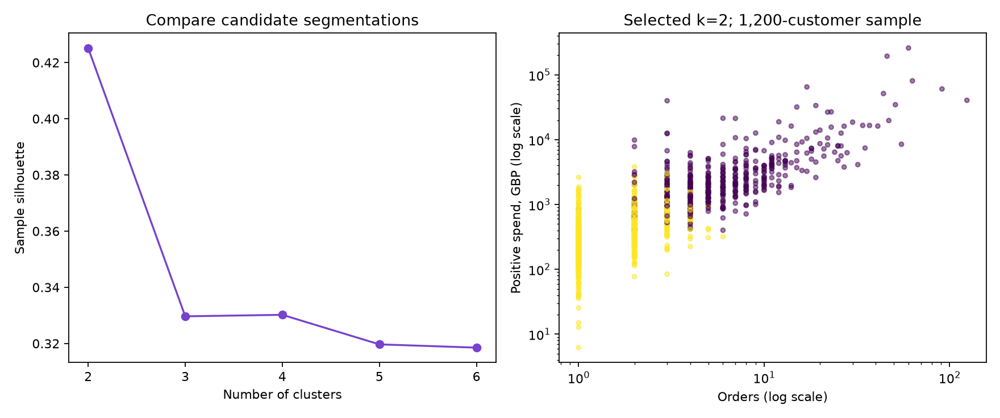

# Customer Segmentation Lab

Can historical purchasing behavior reveal useful customer groups?

**Python · scikit-learn · RFM · K-means · model interpretation**

A reproducible student portfolio project with a complete Python pipeline, an executed explanatory notebook, saved results, tests, and a standalone interactive demo. Built with AI assistance; review the methodology and make your own extensions before describing it as independent work.



## Try the demo

Open `demo/index.html` in a browser. It runs offline and needs no API key, server, or Python packages. If your browser blocks local files, run:

```bash
python run_demo.py
```

Then visit http://127.0.0.1:8000. Change the port with `--port 8001`. The demo uses real exported analysis/model results, not invented values.

## Results

- **4,338 customers** with known IDs.
- Snapshot: **2011-12-10**.
- Highest sample silhouette: **k=2**, score **0.425**.
- Seed sensitivity ARI at selected k: **1.000**.
- The demo compares all candidate k values from 2 through 6.

These are measured results from the included pipeline, not targets or promised production performance.

## Method

Clean positive sales, exclude missing customer IDs, aggregate recency/frequency/monetary values, apply log1p and StandardScaler, then fit K-means for k=2…6 with 20 initializations each. Highest fixed-sample silhouette selects the default. A second seed checks initialization sensitivity. The demo exports anonymous sample points and assigns hypothetical RFM profiles to the nearest fitted center.

## Reproduce

Python 3.12 is the tested version. From this repository folder:

```bash
python -m venv .venv
```

Activate with `.venv\Scripts\Activate.ps1` in Windows PowerShell, or `source .venv/bin/activate` on macOS/Linux. Then:

```bash
python -m pip install -r requirements.txt
python -m src.pipeline
python -m unittest discover -s tests -v
```

The first pipeline run downloads the public dataset from UCI. Subsequent runs use `data/raw/`. Internet access is needed for initial dependency and dataset downloads only. Exact dependency versions are pinned. Reports and `demo/data.js` are regenerated together.

With Node.js 22 or newer, also verify the browser export:

```bash
node tests/test_browser_model.cjs
```

To explore the notebook interactively:

```bash
python -m pip install -r requirements-notebooks.txt
python -m notebook notebooks/analysis.ipynb
```

## Repository layout

- `src/`: documented data preparation and analysis/model code.
- `notebooks/analysis.ipynb`: executed walkthrough with outputs and discussion.
- `reports/`: actual tables, a figure, and a machine-readable analysis export.
- `demo/`: static HTML/CSS/JavaScript app with portable data/model.
- `tests/`: data-quality, calculation, model, and export checks.
- `DATA.md`: citation, CC BY 4.0 license, source hash, transformations.
- `STUDY_GUIDE.md`: concepts, questions, and suggested personal extensions.
- `.github/workflows/checks.yml`: Python and JavaScript checks after upload.

## Limitations

Clusters have no ground-truth labels: silhouette is not accuracy. The chosen solution has two broad groups; more clusters are alternatives, not automatically better. Seed stability is not stability over time. Monetary value excludes refunds. Business actions need prospective validation.

## Publishing later

This folder can be uploaded as its own GitHub repository. The demo consists only of static files and can later be hosted by publishing the contents of `demo/`. No credentials belong in this repository. Raw data and virtual environments are gitignored. No cloud account or paid service is required to run it locally.

## Data and license

See [DATA.md](DATA.md) for the UCI dataset attribution and CC BY 4.0 terms. Authored code is [MIT licensed](LICENSE). The dataset license is separate.
